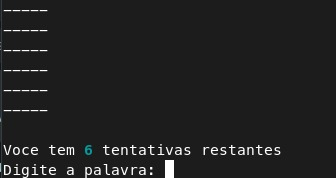
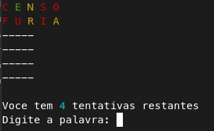
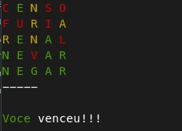

# Wordle Game for Terminal
## Introdução
### Este é um jogo para terminal baseado no [Wordle][link-wordle], [Termo][link-termo] e [Letreco][link-letreco].
> O programa e o código fonte estão em português
## Requisitos
* É necessário ter instalado a versão mais recente do Python no seu computador.
## Como utilizar
### Instalando as bibliotecas necessárias
```bash
$ git clone https://github.com/JotahIvo/woordle-for-terminal.git
$ cd WordleGame
$ pip install -r requirements.txt
```
### Executando o jogo
```bash
$ python wordle_game.py
```
---
No Wordle você possui 6 tentativas para acertar uma palavra de 5 letras.

Após cada tentativa, as letras serão pintadas de acordo com sua posição na palavra secreta.

>Caso a letra fique **vermelha** significa que a palavra secreta não possui essa letra.

>Caso a letra fique **amarela** significa que a palavra possui esta letra, porém está na posição errada.

>Caso a letra fique **verde** significa que a palavra possui a letra e está na posição correta.

Menu do jogo:


Início do jogo:



Tentativas:



Quando vencer o jogo:



## Aproveite o Jogo e se divirta!!

[link-wordle]: https://www.nytimes.com/games/wordle/index.html
[link-termo]: https://term.ooo/
[link-letreco]: https://www.gabtoschi.com/letreco/
[link-palavras]: https://github.com/fserb/pt-br